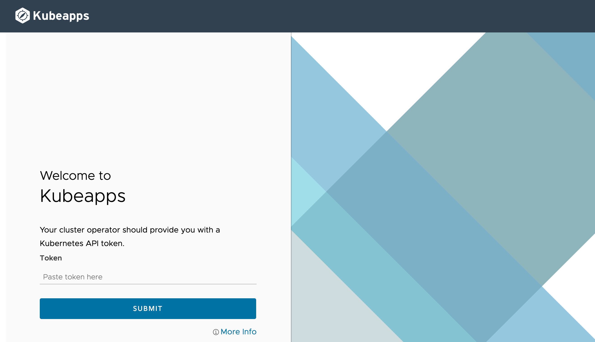
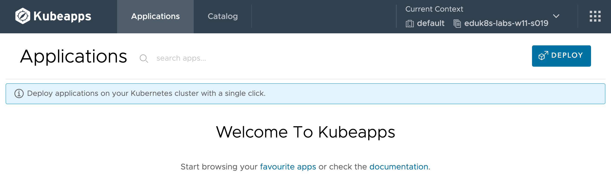

In order to access Kubeapps, you first need to log in to it.

Access to Kubeapps can be configured in multiple ways. This can include integration with any existing login mechanism for users, for accessing the Kubernetes cluster.

If Kubeapps is not integrated with existing user access for a cluster, it will present a generic login page requesting a Kubernetes API token.



For this workshop environment, you can use the Kubernetes API token of the workshop session to access Kubeapps.

Click on the details of the API token below to copy it to your browser paste buffer, then paste it into the Kubeapps login page and click on **Login**.

```copy
{{kubernetes_token}}
```

When successfully logged in, you should be presented with an empty list of applications. This is because nothing has yet been deployed to the namespace used for the workshop session.


