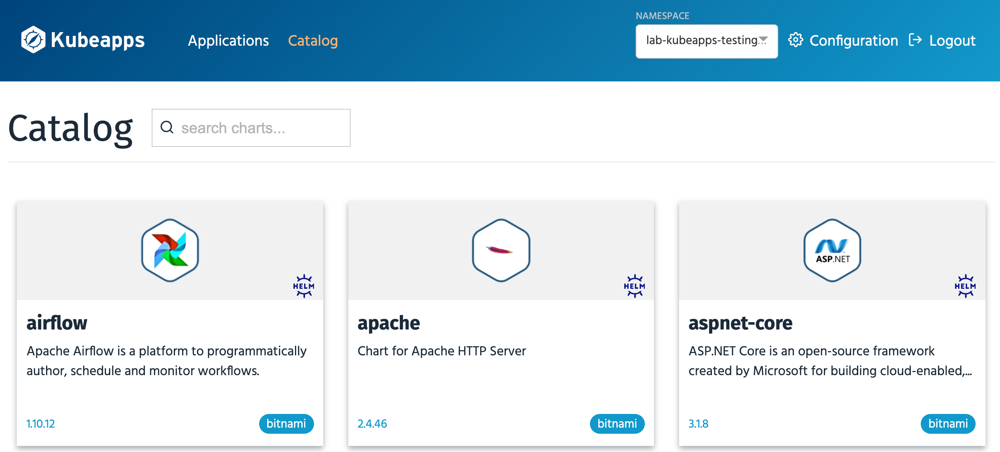

In order to deploy applications using Kubeapps, it first needs to be linked up to an application catalog.

Usually the Kubeapps deployment for the cluster will be pre-configured to be linked to the application catalog that developers within the cluster are permitted to deploy applications from.

This can be the [Bitnami Application Catalog](https://bitnami.com/stacks), or may be a curated catalog specific to the owner of the Kubernetes cluster created using [Tanzu Application Catalog](https://tanzu.vmware.com/application-catalog).

To view whether an application catalog has been linked to Kubeapps in the cluster that this workshop environment is running, click below, or on **Catalog** in the Kubeapps web interface.

```dashboard:open-dashboard
name: Kubeapps
url: {{ingress_protocol}}://{{session_namespace}}-kubeapps.{{ingress_domain}}/#/c/default/ns/{{session_namespace}}/catalog
```

If Kubeapps is already linked to a catalog, you will see something similar to the following.



Because the applications you are allowed to deploy will depend on what has been set up, you may see a different set of applications than what is shown here.

In this case the Kubeapps deployment was configured to use the Bitnami Application Catalog.
