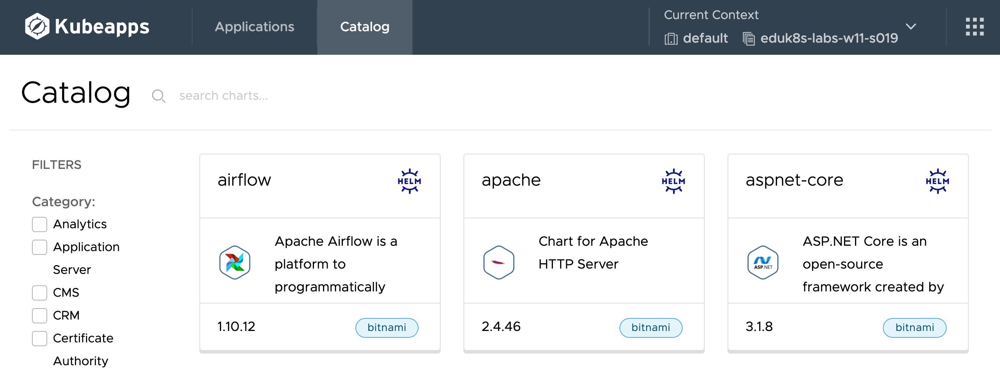

In order to deploy applications using Kubeapps, it first needs to be linked up to an application repository.

Usually the Kubeapps deployment for the cluster will be pre-configured to be linked to the application repository that developers within the cluster are permitted to deploy applications from.

This can be the [Bitnami Application Catalog](https://bitnami.com/stacks), or may be a curated catalog specific to the owner of the Kubernetes cluster created using [Tanzu Application Catalog](https://tanzu.vmware.com/application-catalog).

To view whether a default application repository has been set for Kubeapps in the cluster that this workshop environment is running, click below, or on **Catalog** in the Kubeapps web interface.

```dashboard:reload-dashboard
name: Kubeapps
url: {{ingress_protocol}}://{{session_namespace}}-kubeapps.{{ingress_domain}}/#/c/default/ns/{{session_namespace}}/catalog
```

If Kubeapps is already linked to an application repository, you will see something similar to the following.



Because the applications you are allowed to deploy will depend on what has been set up, you may see a different set of applications than what is shown here.

In this example screenshot the Kubeapps deployment was configured to use the Bitnami Application Catalog.
