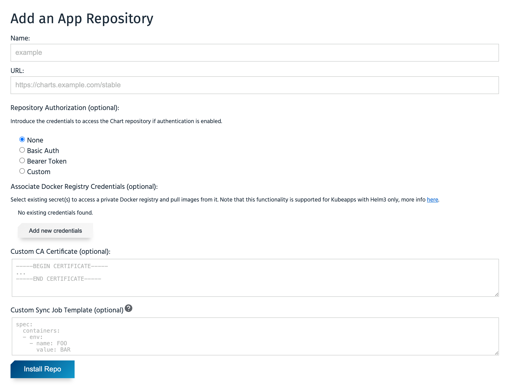
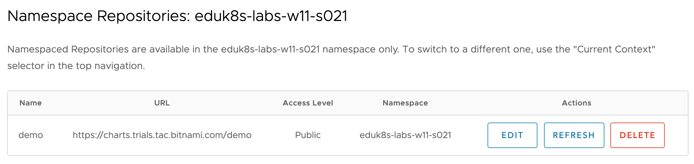

Even when a global default application repository has been configured, provided the user or service account used to access Kubeapps has the appropriate level of access, additional application repositories can be added for use within specific namespaces.

If this capability is available, you can add a new application repository by selecting the **Configuration->App Repositories** drop down menu item.

```dashboard:reload-dashboard
name: Kubeapps
url: {{ingress_protocol}}://{{session_namespace}}-kubeapps.{{ingress_domain}}/#/c/default/ns/{{session_namespace}}/config/repos
```

You should be presented with the page:


It will be empty at this point as no additional respositories have yet been added to the selected namespace.

Although the page describes being able to view application repositories across all namespaces, this will not work in this workshop environment as the user you are accessing Kubeapps does not have the appropriate rights to search other namespaces.

The restriction here is because the ability to add or list applications repositories (other than the default), makes use of Kubernetes custom resources. As such, what you can do is controlled through RBAC (role based access control). In this workshop environment you only have the ability to create, list and delete the custom resource definition describing an application repository in the namespace used for the workshop.

To add a new application repository, click on the **Add App Repository** button. This will yield the popup:



In this popup, for the **Name** field enter:

```copy
demo
```

and for the **URL** field enter:

```copy
https://charts.trials.tac.bitnami.com/demo
```

Click on **Install Repo**, to add this application repository.

You should now see this repository listed.


