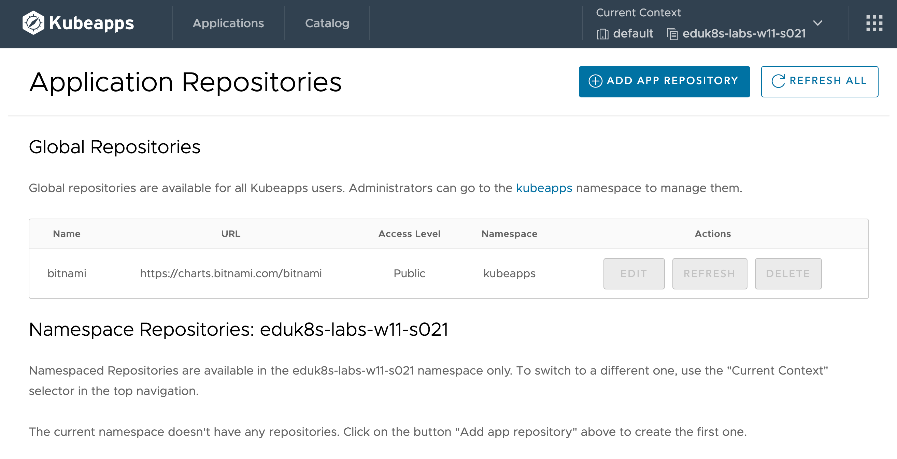
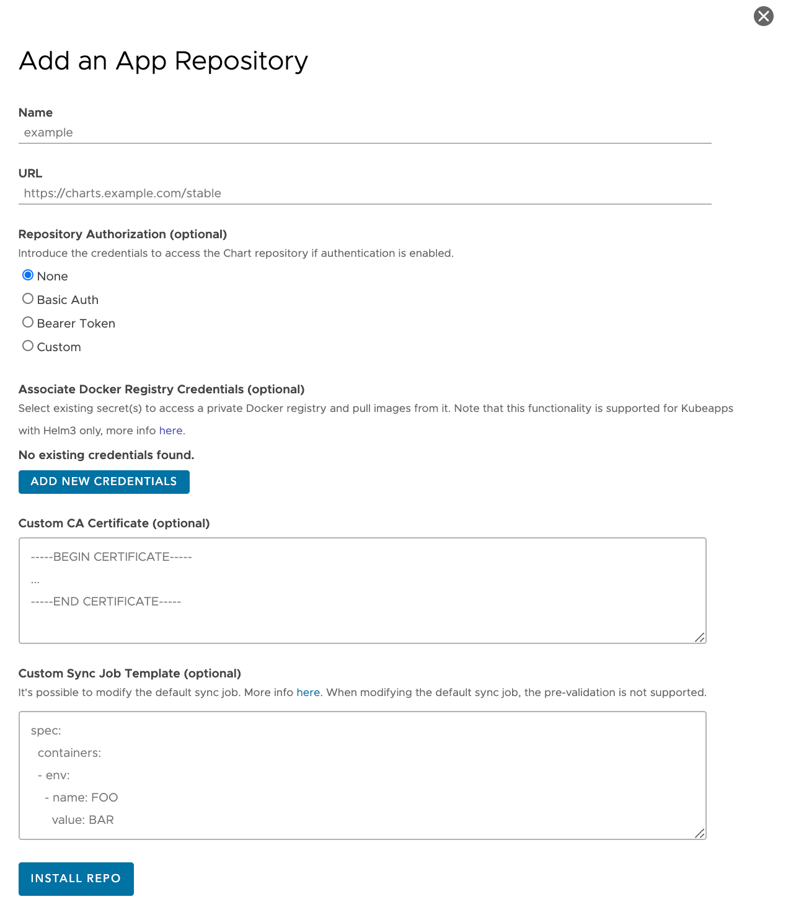

Even when a global default application repository has been configured, provided the user or service account used to access Kubeapps has the appropriate level of access, additional application repositories can be added for use within specific namespaces.

If this capability is available, you can add a new application repository by selecting the **App Repositories** item under the drop down menu grid top right.

```dashboard:reload-dashboard
name: Kubeapps
url: {{ingress_protocol}}://{{session_namespace}}-kubeapps.{{ingress_domain}}/#/c/default/ns/{{session_namespace}}/config/repos
```

You should be presented with the page:



If there are any globally enabled catalogs they will be listed.

There should not be any catalogs registered against the current namespace.

To add a new application repository to the current namespace, click on the **Add App Repository** button. This will yield the popup:



In this popup, for the **Name** field enter:

```copy
demo
```

and for the **URL** field enter:

```copy
https://charts.trials.tac.bitnami.com/demo
```

All other fields can be left empty for this example.

Click on **Install Repo** at the bottom of the popup to add this application repository.

You should now see this repository listed against the namespace.


