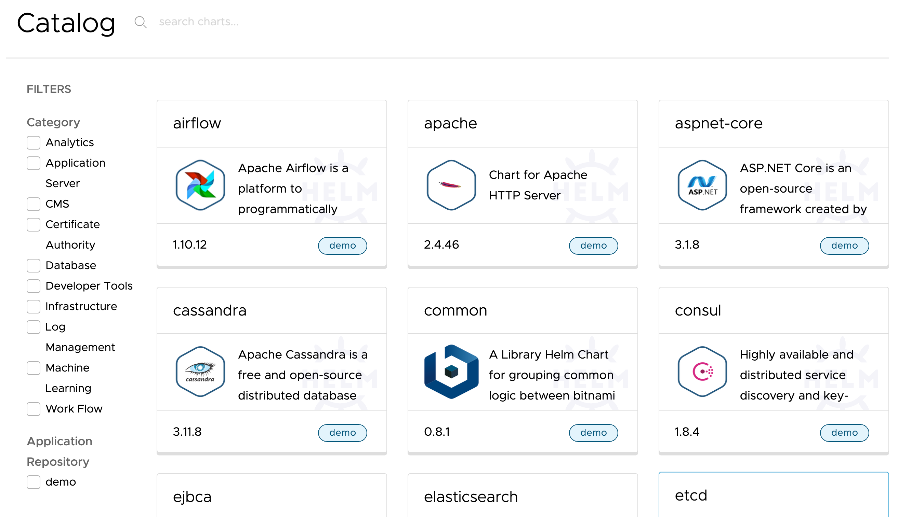

Having added an application repository, let's now deploy an application.

Head back to the Kubeapps dashboard by clicking on the **Kubeapps** dashboard tab.

```dashboard:open-dashboard
name: Kubeapps
```

From the list of application repositories, click on the repo link for ``demo``.

```dashboard:reload-dashboard
name: Kubeapps
url: {{ingress_protocol}}://{{session_namespace}}-kubeapps.{{ingress_domain}}/#/c/default/ns/{{session_namespace}}/catalog/demo
```

This should bring up the page of applications available to be deployed from the ``demo`` application repository.



You could also have clicked on **Catalog** in the Kubeapps web interface, but it would have listed applications available across all application repositories, and we wanted to focus on just the ``demo`` application repository.

In the list of applications, click on the tile for the Apache HTTPD Server (apache).

```dashboard:reload-dashboard
name: Kubeapps
url: {{ingress_protocol}}://{{session_namespace}}-kubeapps.{{ingress_domain}}/#/c/default/ns/{{session_namespace}}/charts/demo/apache
```

This will provide the details of the application, versions available, how it can be configured etc.


