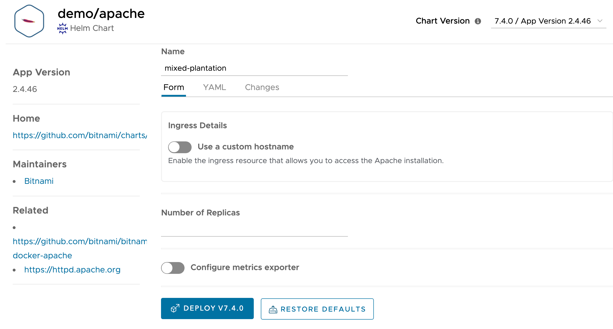
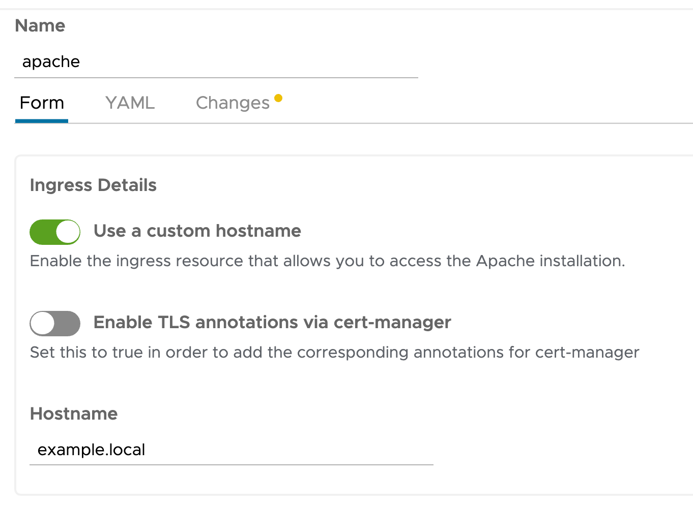
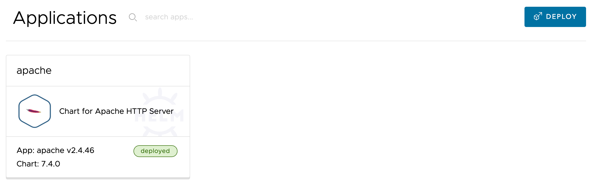

Although the description for the application provides the steps you can manually run to deploy it, this is not required.

Instead, to deploy the application into the current namespace of the Kubernetes cluster, you need only click on the **Deploy** button within the Kubeapps web interface.

Click on the **Deploy** button to start the deployment process.

This should bring up the page:



This confirms what application is to be deployed and from which application repository. A suggested name for the deployment is automatically populated in the **Name** field.

Override the suggested name of the deployment and set it to:

```copy
apache
```

We want to be able to expose the application to users using an ingress, so enable this by selecting **Use a custom hostname**.



In the **Hostname** field, replace the value of `example.local` with:

```copy
apache-{{session_namespace}}.{{ingress_domain}}
```

In this case you are making use of the ingress domain name used for the workshop environment and everything has been pre-configured so it will work. If this was in your own cluster, you would need to have your own custom domain, and have DNS configured to direct the chosen hostname to the ingress router for the cluster.

Before triggering deployment of an application, you can review any changes made to the default Helm deployment templates for the application based on options selected for the application through Kubeapps. You can also review the raw YAML for the Helm template.

When ready, click on **Deploy** at the bottom of the page to start the deployment.

This will bring up details of the deployment, and when deployment is complete, it should show as **Ready**.


Click on the link for the ingress to confirm the Apache HTTPD server is running. A new browser tab or window should be created and you should see a response of "It works!".

When done checking it works, head back here and click on **Applications** in the Kubeapps web interface.

```dashboard:reload-dashboard
name: Kubeapps
url: {{ingress_protocol}}://{{session_namespace}}-kubeapps.{{ingress_domain}}/#/c/default/ns/{{session_namespace}}/apps
```

This should land you on the list of applications which have been deployed to the namespace through Kubeapps.


