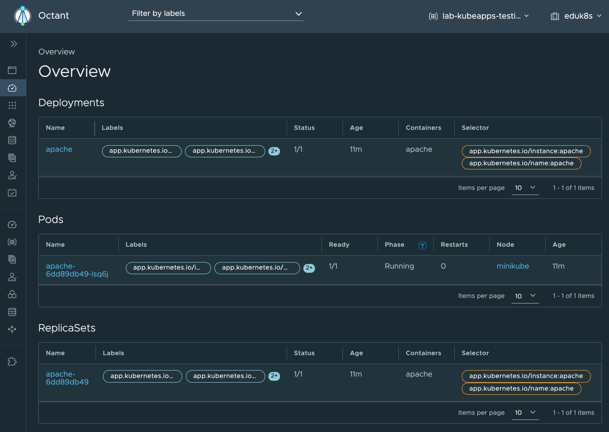

Although Kubeapps provides the ability to deploy applications into a Kubernetes cluster, it is not a replacement for needing to use a Kubernetes dashboard or command line tools such as `kubectl` for managing your application. The purpose of Kubeapps is to provide a developer an easy way to deploy pre-packaged applications, be these applications from the Bitnami Application Catalog, or specific applications approved by an organization, managed using the Tanzu Application Catalog service.

You can therefore still use a Kubernetes dashboard to investigate the application which was deployed.

Jump over to the Kubernetes web console provided by clicking on the **Console** tab.

```dashboard:open-dashboard
name: Console
```

In this workshop environment [Octant](https://octant.dev/) has been provided as the web console.



Here you should be able to see the deployment resources which have been created and manage the application.

You can also view the resources using `kubectl` by using the terminal. Click on the **Terminal** tab.

```dashboard:open-dashboard
name: Terminal
```

and execute:

```execute
kubectl get all
```

The output should be similar to:

```
NAME                         READY   STATUS    RESTARTS   AGE
pod/apache-6dd89db49-lsq6j   1/1     Running   0          14m

NAME             TYPE           CLUSTER-IP      EXTERNAL-IP   PORT(S)                      AGE
service/apache   LoadBalancer   10.111.154.11   <pending>     80:32239/TCP,443:30769/TCP   14m

NAME                     READY   UP-TO-DATE   AVAILABLE   AGE
deployment.apps/apache   1/1     1            1           14m

NAME                               DESIRED   CURRENT   READY   AGE
replicaset.apps/apache-6dd89db49   1         1         1       14m
```
