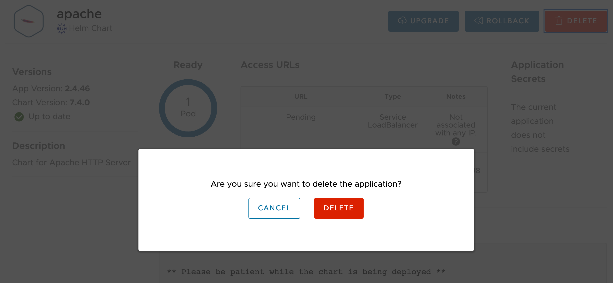

The deployment of the application can be deleted from the Kubernetes dashboard or from the command line using `kubectl`, but this means you have to know precisely what all the Kubernetes resources that were created were.

The better method therefore is to use Kubeapps to delete the deployment. This will make use of the Helm templates used in the deployment, to ensure that all the resources created are correctly deleted,

Head back to Kubeapps by clicking on the **Kubeapps** tab.

```dashboard:open-dashboard
name: Kubeapps
```

From the applications list, select on the deployment of the Apache HTTPD server.

```dashboard:reload-dashboard
name: Kubeapps
url: {{ingress_protocol}}://{{session_namespace}}-kubeapps.{{ingress_domain}}/#/c/default/ns/{{session_namespace}}/apps/apache
```

This should return you to the details of the deployment.

Click on the big red **Delete** button. A popup should be displayed asking you to confirm that you want to delete the deployment.



Click on **Delete** to confirm.

You will be returned to your list of applications (which should now be empty), and the deployment will be deleted in the background.
